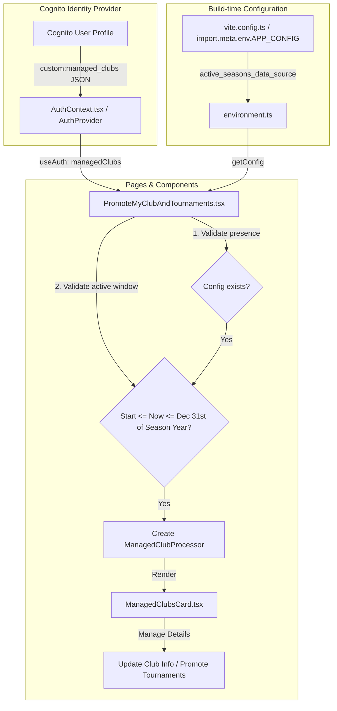

# Actively Managed Clubs Domain Logic From Cognito Users & Configuration Files

This document explains how the **logged-in user's managed clubs** (stored in Cognito user profiles) and the **configured active seasons** (stored in build-time configuration files) come together in the front-end codebase to drive the visualisation of functions specific for a club manager, in the pages Promote My Club & Tournaments, My Club Teams, and My Club Standings.

---

## 1. User's Managed Clubs

The user's managed clubs represent the leagues, seasons, and clubs that the logged-in user is registered to manage in the app.

### Domain Model
The `ManagedClub` represents a user registration as a club manager for a specific club in a league and season:
- `league` (e.g., "CLTTL"),
- `season` (e.g., "2025"),
- `club_name` (e.g., "Table Tennis Aces Club"),
- `club_location` (e.g., "London"),
- `manager_name` (e.g., "John Doe")

In practise, a user can only manage one club during a single season of a league, therefore a user cannot have two managed clubs with the same league + season.
However it is common for a user to manage the same club across multiple seasons, so a user can have multiple managed clubs with the same league + club_name each with a different season.

Note: While these real-world rules are generally valid, they are not strictly enforced in the codebase, and the system's logic does not rely on them.


### Data Source and Retrieval
1. **Cognito Custom Attribute**: The user's managed clubs are stored in **Cognito** under the custom user attribute `custom:managed_clubs` (or fallback `managed_clubs`).
2. **Parsing**:
   * When the user session is verified (on mount) or after standard sign-in, the provider validates and converts the raw JSON string value into an array of `ManagedClub` objects.
3. **State Management**: The parsed array is stored globally in the `AuthProvider` component state and exposed as a `managedClubs` page variable.

### Files Involved
The implementation files are located in the:
* [contexts folder](TTLeaguePlayersApp.FrontEnd/src/contexts/) 

### Additional Details For The Agent
* **Parsing Validation**: The parser `parseManagedClubsJson` checks that structural properties (`league`, `season`, `club_name`, `club_location`, `manager_name`) are valid strings. If the raw attribute is missing, invalid JSON, or structurally invalid, it returns `[]`.
* **State Updates**: The application exposes context functions to allow re-fetching Cognito attributes on-demand (similar to `refreshActiveSeasons` for active player registrations) to ensure the local user state is updated when manager status changes.

---

## 2. Active League Seasons Configuration Info

Configured seasons come from the config files included in the delivered app, that also define the processing logic, the metadata, and start-end date boundaries of the league's season.

### Domain Model
The global configuration contains a list of supported data sources under `active_seasons_data_source` for a specific league and season:
- `league` (e.g., "CLTTL"),
- `season` (e.g., "2025"),
- `registrations_start_date` (epoch timestamp in seconds when user registration & match rating starts),
- `ratings_end_date` (epoch timestamp in seconds when the season match rating ends),
- etc.

### Data Source and Retrieval
* The configuration is build-time environment-dependent (prod, staging, test, dev). The configuration file is injected directly into the bundle.
* The configuration is then loaded synchronously at runtime.

### Files Involved
The implementation files are located in:
* [config folder](TTLeaguePlayersApp.FrontEnd/src/config/)

### Additional Details For The Agent
* **Bundler Injection**: The bundler (Vite) replaces references to `import.meta.env.APP_CONFIG` with the actual JSON configuration file matching the active target environment.
* **Retrieval Hook**: The `getConfig()` function in [environment.ts](TTLeaguePlayersApp.FrontEnd/src/config/environment.ts) retrieves this config synchronously.

---

## 3. User's Actively Managed Clubs Logic: User's Managed Clubs + Active League Seasons Configuration Info

The club management and promotion logic resolves and merges the user’s managed clubs with the global league configurations to decide which mahaged clubs to dislplay together with the related club management features.

### Business Logic
1. **Club Presence Check**:
   * If the user has zero `managedClubs`, a warning/info state is displayed stating that the user is not registered as a club manager, along with instructions on how to request manager credentials.
2. **Matching Configuration Check**:
   * Every user's `ManagedClub` league and season are searched among the active league seasons in the configuration info matching the league and the season. If no matching config is found, the club is skipped; otherwise, it is a match.
3. **Time Window Check (Relaxed Period)**:
   * Unlike player-focused ratings (which must strictly fall between `registrations_start_date` and `ratings_end_date`), the promotion window for club managers is more relaxed.
   * The current system epoch time (`now`) can fall inside the active start date and end dates extended to the last day of the season's end date calendar year (i.e., `registrations_start_date` <= `now` <= December 31st of the season's end date year). This allows managers to continue promoting their clubs and upcoming tournaments even after active match play has concluded for the season.
4. **Managed CLub selection**:
   * If both the Matching Configuration and the relaxed Time Window checks succeed, the managed club card is rendered with the matching Managed Clubs, and the features are made available by the page once a club is selected.
   *  Matching Configuration Check is done also for the features that are specific only to the club (Club Name + Location) because the club manager is assigned at every league's season, not indefently.
5. **Group By Club Name + Location**:
   *  For features that are specific to the club (Club Name + Location), like publishing the club info or a clem's tournament, matches with the same Club Name and Location are collapsed into one button. 
   *  For features that are specific to the club (Club Name + Location) and the league's season, like showing the club's teams registration status and kudos standings, one button per club and league's season is visualised.

 

This graph represents such logic:

```
                  User's Managed Clubs (Cognito)
                                |
                   Iterate each managed club
                                |
             Does a matching config data source exist?
             /                                       \
          [No]                                       [Yes]
           /                                           \
    Throw/Log Error                             Check time window
                                         (Start <= Now <= Dec 31st of the end of Season Year)
                                            /                  \
                                         [No]                  [Yes]
                                          /                      \
                                    Ignore club         Render ManagedClubsCard
```

### Files Involved
The implementation file of this logic will be located in:
* [PromoteMyClub Page](TTLeaguePlayersApp.FrontEnd/src/pages/PromoteMyClub.tsx)
* [PromoteMyTournaments Page](TTLeaguePlayersApp.FrontEnd/src/pages/PromoteMyTournaments.tsx)
* [MyClubTeams Page](TTLeaguePlayersApp.FrontEnd/src/pages/MyClubTeams.tsx)
* [MyClubStandings Page](TTLeaguePlayersApp.FrontEnd/src/pages/MyClubStandings.tsx)

### Additional Details For The Agent
* **System Time Fetching**: Current time is checked by retrieving epoch seconds using `getClockTimeInEpochSeconds()` from [DateUtils.ts](TTLeaguePlayersApp.FrontEnd/src/utils/DateUtils.ts).
* **Processor Factory Pattern**: The page constructs the processing logic dynamically via `createActiveSeasonProcessor(...)` in [ActiveSeasonProcessorFactory.ts](TTLeaguePlayersApp.FrontEnd/src/service/active-season-processors/ActiveSeasonProcessorFactory.ts). This maps the config strategy key (`custom_processor`) to the corresponding parsing engine class and injects scraping parameters.

---

## 4. Visualisation and Interactions on the Managed Club Card

The managed club card visualises the actively managed club's details, and handles individual club features such as promotiing the club and its tournaments, visualising the list of club's teams and the status of their registration to this app, and the kudos standing for all the teams.

Since a user can manage multiple clubs (e.g. managing different clubs in different leagues, or the same club across different seasons), the pages for club managers allow the user to toggle between the multiple clubs, and then visualises the features  related to the club visually selected.

### Files Involved
The component will be implemented in:
* [ManagedClubsCard.tsx](TTLeaguePlayersApp.FrontEnd/src/components/ui/ManagedClubsCard.tsx) (Planned)

---

## Promote My Club Page: Example Of The Data Flow Of This Logic

The diagram below outlines how the user context, build-time configurations, pages, and components will interact to render actively managed clubs and promotion capabilities:


