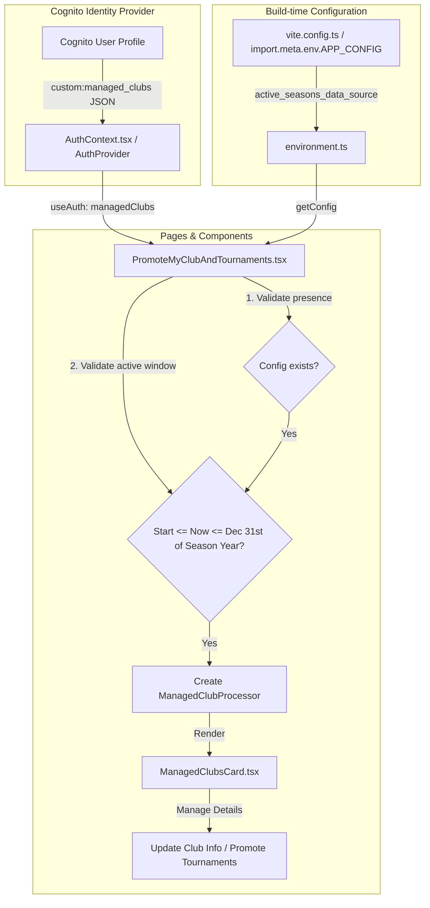

# Actively Managed Clubs Domain Logic From Cognito Users & Configuration Files

This document explains how the **logged-in user's managed clubs** (stored in Cognito user profiles) and the **configured active seasons** (stored in build-time configuration files) come together in the front-end codebase to drive the visualisation of functions specific for a club manager, in the pages Promote My Club & Tournaments, My Club Teams, and My Club Standings.

---

## 1. User's Managed Clubs

The user's managed clubs represent the leagues, seasons, and clubs that the logged-in user is registered to manage in the app.

### Domain Model
The `ManagedClub` represents a user registration as a club manager for a specific club in a league and season:
- `league` (e.g., "CLTTL"),
- `season` (e.g., "2025-2026"),
- `club_name` (e.g., "Table Tennis Aces Club"),
- `club_location` (e.g., "London"),
- `manager_name` (e.g., "John Doe")

In practise, a user can only manage one club during a single season of a league, therefore a user cannot have two managed clubs with the same league + season.
However it is common for a user to manage the same club across multiple seasons, so a user can have multiple managed clubs with the same league + club_name each with a different season.

Note: While these real-world rules are generally valid, they are not strictly enforced in the codebase, and the system's logic does not rely on them.


### Data Source and Retrieval
1. **Cognito Custom Attribute**: The user's managed clubs are stored in **Cognito** under the custom user attribute `custom:managed_clubs` (or fallback `managed_clubs`).
2. **Parsing**:
   * When the user session is verified (on mount) or after standard sign-in, the provider validates and converts the raw JSON string value into an array of `ManagedClub` objects.
3. **State Management**: The parsed array is stored globally in the `AuthProvider` component state and exposed as a `managedClubs` page variable.

### Files Involved
The implementation files are located in the:
* [contexts folder](TTLeaguePlayersApp.FrontEnd/src/contexts/) 

### Additional Details For The Agent
* **Parsing Validation**: The parser `parseManagedClubsJson` checks that structural properties (`league`, `season`, `club_name`, `club_location`, `manager_name`) are valid strings. If the raw attribute is missing, invalid JSON, or structurally invalid, it returns `[]`.
* **State Updates**: The application exposes context functions to allow re-fetching Cognito attributes on-demand (similar to `refreshActiveSeasons` for active player registrations) to ensure the local user state is updated when manager status changes.

---

## 2. Active League Seasons Configuration Info

Configured seasons come from the config files included in the delivered app, that also define the processing logic, the metadata, and start-end date boundaries of the league's season.

### Domain Model
The global configuration contains a list of supported data sources under `active_seasons_data_source` for a specific league and season:
- `league` (e.g., "CLTTL"),
- `season` (e.g., "2025"),
- `registrations_start_date` (epoch timestamp in seconds when user registration & match rating starts),
- `ratings_end_date` (epoch timestamp in seconds when the season match rating ends),
- `custom_processor` (the `ActiveSeasonProcessor` strategy for the player/captain flows),
- `custom_club_processor` (the `ManagedClubProcessor` strategy for the club-manager flows),
- `club_teams` (one entry per club of the league: the club name mapped to the URL of that club's page; empty when the league has no club pages),
- etc.

Note the shape of `club_teams`: it mirrors its siblings `division_tables`, `division_fixtures` and `division_players` exactly — an array of single-entry objects read through the same `getUrlFromSource` helper — but it is keyed by club name rather than by division.

### Data Source and Retrieval
* The configuration is build-time environment-dependent (prod, staging, test, dev). The configuration file is injected directly into the bundle.
* The configuration is then loaded synchronously at runtime.

### Files Involved
The implementation files are located in:
* [config folder](TTLeaguePlayersApp.FrontEnd/src/config/)

### Additional Details For The Agent
* **Bundler Injection**: The bundler (Vite) replaces references to `import.meta.env.APP_CONFIG` with the actual JSON configuration file matching the active target environment.
* **Retrieval Hook**: The `getConfig()` function in [environment.ts](TTLeaguePlayersApp.FrontEnd/src/config/environment.ts) retrieves this config synchronously.

---

## 3. User's Actively Managed Clubs Logic: User's Managed Clubs + Active League Seasons Configuration Info

The club management and promotion logic resolves and merges the user’s managed clubs with the global league configurations to decide which mahaged clubs to dislplay together with the related club management features.

### Business Logic
1. **Club Presence Check**:
   * If the user has zero `managedClubs`, a warning/info state is displayed stating that the user is not registered as a club manager, along with instructions on how to request manager credentials.
2. **Matching Configuration Check**:
   * Every user's `ManagedClub` league and season are searched among the active league seasons in the configuration info matching the league and the season. If no matching config is found, the club is skipped; otherwise, it is a match.
3. **Time Window Check (Relaxed Period)**:
   * Unlike player-focused ratings (which must strictly fall between `registrations_start_date` and `ratings_end_date`), the promotion window for club managers is more relaxed.
   * The current system epoch time (`now`) can fall inside the active start date and end dates extended to the last day of the season's end date calendar year (i.e., `registrations_start_date` <= `now` <= December 31st of the season's end date year). This allows managers to continue promoting their clubs and upcoming tournaments even after active match play has concluded for the season.
4. **Managed CLub selection**:
   * If both the Matching Configuration and the relaxed Time Window checks succeed, the managed club card is rendered with the matching Managed Clubs, and the features are made available by the page once a club is selected.
   *  Matching Configuration Check is done for the features related to the club's league season (League + Season + Club Name + Location), such as listing the club's teams registratins and standings, and also for featrures that are specific to the club (Club Name + Location) as promoting the team and its tournament, because the club manager is assigned at every league's season, not indefently.
5. **Grouping the buttons: the `groupByLocation` prop**:
   *  The flag on [ManagedClubsCard.tsx](TTLeaguePlayersApp.FrontEnd/src/components/ui/ManagedClubsCard.tsx) is named **`groupByLocation`** (it defaults to `false`). Earlier drafts of this document called it "Group By Club Name"; that name never existed in the code.
   *  **`groupByLocation` set to `true`** — for features that are specific to the club (Club Name + Location), like publishing the club info or a club's organised tournament. Managed clubs sharing the same **Club Name + Location** are collapsed into one button, so the same club managed across several seasons shows once. The button label is the location alone, or `"<club_location> / <club_name>"` when that location has more than one club. This is what `PromoteMyClub.tsx` and `PromoteMyTournaments.tsx` pass.
   *  **`groupByLocation` set to `false`** — for features specific to the club *and* the league's season (League + Season + Club Name + Location), like showing the club's teams registration status and kudos standings. One button per managed club is visualised, labelled `"<club_location> / <league>"`. No page uses this branch yet; My Club Teams and My Club Standings are the pages it exists for.
   *  Either way the button's key is `createManagedClubKey(club)` = `` `${league}-${season}-${club_name}` `` ([clubUtils.ts](TTLeaguePlayersApp.FrontEnd/src/utils/clubUtils.ts)), so the selection always resolves back to a single `ManagedClub` — and from it to `club_location` as well.
   *  Note the `false` label carries the league but **not the season**, so a manager of the same club in two seasons of one league would see two buttons with identical labels. The keys differ; only the labels collide. To be reviewed when My Club Teams is implemented.

 

This graph represents such logic:

```
                  User's Managed Clubs (Cognito)
                                |
                   Iterate each managed club
                                |
             Does a matching config data source exist?
             /                                       \
          [No]                                       [Yes]
           /                                           \
    Throw/Log Error                             Check time window
                                         (Start <= Now <= Dec 31st of the end of Season Year)
                                            /                  \
                                         [No]                  [Yes]
                                          /                      \
                                    Ignore club         Render ManagedClubsCard
```

### Files Involved
The implementation files of this logic are located in:
* [PromoteMyClub Page](TTLeaguePlayersApp.FrontEnd/src/pages/PromoteMyClub.tsx) — implemented
* [PromoteMyTournaments Page](TTLeaguePlayersApp.FrontEnd/src/pages/PromoteMyTournaments.tsx) — implemented
* [MyClubTeams Page](TTLeaguePlayersApp.FrontEnd/src/pages/MyClubTeams.tsx) — placeholder, "Coming Soon"; this is the page the `ManagedClubProcessor` of section 5 exists to serve
* [MyClubStandings Page](TTLeaguePlayersApp.FrontEnd/src/pages/MyClubStandings.tsx) — placeholder, "Coming Soon"

### Additional Details For The Agent
* **System Time Fetching**: Current time is checked by retrieving epoch seconds using `getClockTimeInEpochSeconds()` from [DateUtils.ts](TTLeaguePlayersApp.FrontEnd/src/utils/DateUtils.ts).
* **Club Processor Factory Pattern**: The club-manager pages construct their processing logic via `createManagedClubProcessor(...)` in [ManagedClubProcessorFactory.ts](TTLeaguePlayersApp.FrontEnd/src/service/active-season-processors/ManagedClubProcessorFactory.ts). This maps the config strategy key (`custom_club_processor`) to the corresponding parsing engine class, and injects the club name plus the scraping parameters.
	* This is a **separate port** from the `ActiveSeasonProcessor` used by the player/captain flows, and deliberately so. `ActiveSeasonProcessor.getTeamFixtures()` needs a division and a team, which come from `custom:active_seasons`; a club manager has only a club, from `custom:managed_clubs`. Different binding tuple, different interface. Both are nonetheless resolved against the **same** `active_seasons_data_source` entry, matched on league + season.
	* The factory wraps the processor in `ManagedClubProcessorWithLocalStorageCache` (same 72h fresh / 6d stale SWR policy as the fixtures cache), under the key `cache_club_{league}_{season}_{club}` — distinct from the fixtures key `cache_{league}_{season}_{division}_{team}`, since a club's teams do not vary by division or team.

---

## 4. Visualisation and Interactions on the Managed Club Card

The managed club card visualises the actively managed club's details, and handles individual club features such as promotiing the club and its tournaments, visualising the list of club's teams and the status of their registration to this app, and the kudos standing for all the teams.

Since a user can manage multiple clubs (e.g. managing different clubs in different leagues, or the same club across different seasons), the pages for club managers allow the user to toggle between the multiple clubs, and then visualises the features  related to the club visually selected.

### Files Involved
The component is implemented in:
* [ManagedClubsCard.tsx](TTLeaguePlayersApp.FrontEnd/src/components/ui/ManagedClubsCard.tsx), used by [PromoteMyClub.tsx](TTLeaguePlayersApp.FrontEnd/src/pages/PromoteMyClub.tsx) and [PromoteMyTournaments.tsx](TTLeaguePlayersApp.FrontEnd/src/pages/PromoteMyTournaments.tsx)

---

## 5. Reading a Club's Teams

`ManagedClubProcessor.getClubTeams()` reads the teams of one club from that club's page on the league site, orchestrated by [CLTTLManagedClub2025Processor.ts](TTLeaguePlayersApp.FrontEnd/src/service/active-season-processors/CLTTLManagedClub2025Processor.ts) and mirroring the shape of the existing `getTeams()`:

1. **Look up the club's page URL** in the league season's configured `club_teams`, keyed by the manager's `club_name` from Cognito. If the club has no entry, throw `Club "<name>" not found in data source.`
2. **Fetch that page** and parse `div#TeamsList` → the first `<td> > a` of each row, giving the team names.

### Additional Details For The Agent
* **The club → page URL map is configuration, not scraped.** An earlier design fetched the league's clubs list page and followed the link for the manager's club. Listing the clubs in `club_teams` instead makes this a single hop, identical in shape to the per-division lookups, and keeps the caching decorator the only place that caches. The cost is that the list is maintained by hand when clubs join or leave the league — the same cost the per-division URLs already carry.
* **The lookup is exact and case-sensitive**, through the same `getUrlFromSource` helper the division lookups use, so Cognito's `club_name` must match the configured spelling byte for byte — including `AA Academy @ SJoA` and the straight apostrophe in `St Katharine's Trust`.
* **No season filtering is applied.** The club page's second column shows a season label such as `"Winter 2025-26"`, which does not textually match the config's `season` (`"2025-2026"`), and the page carries no season in its URL. Every listed team is returned.
* **A club with no configured page throws before any network call**: `Club "<name>" not found in data source.` This also covers leagues configured with an empty `club_teams`, such as BCS and FLICK.
* **Test coverage is deliberately split.** [CLTTLManagedClub2025Processor.integration.test.ts](TTLeaguePlayersApp.FrontEnd/test/unit/service/active-season-processors/CLTTLManagedClub2025Processor.integration.test.ts) pins exact team names against HTML captured under `clttl-2025/data/`, while the e2e spec asserts only that the live page still contains `id="TeamsList"` — the live page has no archived version, so a season rollover must not turn the build red.
* **Captured fixtures must be scrubbed before committing.** The live pages carry club contacts, team captains' mobile numbers and email addresses, and a third-party Google Maps API key. Run [scrub_clttl_fixtures.py](scripts/test_fixtures/scrub_clttl_fixtures.py) over any freshly captured fixture; it preserves every structure the parser navigates and reports anything sensitive left behind.

---

## Promote My Club Page: Example Of The Data Flow Of This Logic

The diagram below outlines how the user context, build-time configurations, pages, and components interact to render actively managed clubs and promotion capabilities:


```mermaid
graph TD
    subgraph Cognito Identity Provider
        C[Cognito User Profile] -->|custom:managed_clubs JSON| ACP[AuthContext.tsx / AuthProvider]
    end

    subgraph Build-time Configuration
        BC[vite.config.ts / import.meta.env.APP_CONFIG] -->|active_seasons_data_source| ENV[environment.ts]
    end

    subgraph Pages & Components
        ACP -->|useAuth: managedClubs| PM[PromoteMyClubAndTournaments.tsx]
        ENV -->|getConfig| PM
        
        PM -->|1. Validate presence| V1{Config exists?}
        PM -->|2. Validate active window| V2{Start <= Now <= Dec 31st of Season Year?}
        
        V1 -->|Yes| V2
        V2 -->|Yes| P[Create ManagedClubProcessor]
        
        P -->|Render| MCC[ManagedClubsCard.tsx]
        MCC -->|Manage Details| MD[Update Club Info / Promote Tournaments]
    end
```
