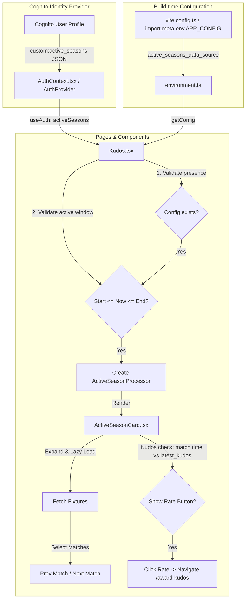

# In-season Domain Logic From Cognito Users & Configuration Files

This document explains how the **logged-in user's active seasons** (stored in Cognito user profiles) and the **configured active seasons** (stored in build-time configuration files) come together in the front-end codebase to drive the In-seasons fixtures and match results visualisations, as currently implemented in the Kudos page.

---

## 1. User's Active Seasons

The user's active seasons represent the leagues, seasons, and teams to which the logged-in user is registered with, in the app.

### Domain Model
The `ActiveSeason` represents a user registration for a specific league and season: 
- `league` (e.g., "CLTTL"), 
- `season` (e.g., "2025"), 
- `team_name` (e.g., "Table Tennis Aces"), 
- `team_division` (e.g., "Division 1"), 
- etc.

In practice, a user can only be registered to one team per division during a single season of a league. Throughout the season, a user may move up to a higher division or, in rare cases, move down. Occasionally, a user might play for another team within the same club and division, but this typically does not result in a formal registration for that second team.

Therefore, a user will generally have a maximum of one registration for the same league + season + team_division. However, it is common for a user to play for the same team and division across multiple seasons and therefore to have multiple registrations for the same league + team_division (but not season).

Note: While these real-world rules are generally valid, they are not strictly enforced in the codebase, and the system's logic does not rely on them.

### Data Source and Retrieval
1. **Cognito Custom Attribute**: The user's active seasons are stored in **Cognito** under the custom user attribute `custom:active_seasons` (or fallback `active_seasons`).
2. **Parsing**: 
   * When the user session is verified (on mount) or after standard sign-in, the provider validates and converts the raw JSON string value into an array of `ActiveSeason` objects.
3. **State Management**: The parsed array is stored globally in the `AuthProvider` component state and exposed as a `activeSeasons` page variable.

### Files Involved
The implementation files are located in the:
* [contexts folder](TTLeaguePlayersApp.FrontEnd/src/contexts/) 

### Additional Details For The Agent
* **Parsing Validation**: The parser `parseActiveSeasonsJson` checks that structural properties (`league`, `season`, `team_name`, `team_division`, `person_name`, `role`) are valid strings. It also filters `latest_kudos` to ensure it only contains numeric timestamps. If the raw attribute is missing, invalid JSON, or structurally invalid, it returns `[]`.
* **State Updates**: The application exposes `refreshActiveSeasons` through the context interface to allow re-fetching Cognito attributes on-demand (e.g., after updating registration status).

---

## 2. Active League Seasons Configuration Info

Configured seasons come from the config files included in the delivered app, that also define the processing logic, the metadata, and start-end date boundaries of the league's season.

### Domain Model
The global configuration contains a list of supported data sources under `active_seasons_data_source` for a specific league and season with a start and end date: 
- `league` (e.g., "CLTTL"), 
- `season` (e.g., "2025"), 
- `registrations_start_date` (epoch timestamp in seconds when user registration & match rating starts),
- `ratings_end_date` (epoch timestamp in seconds when the season match rating ends),
- etc.

In the configuration file, an active_seasons_data_source should contain only one entry per unique league and season combination, without duplicates. However, a league can span multiple seasons, resulting in multiple entries across different seasons. The start and end dates of different seasons should not overlap.

Note: While this constraint is not strictly enforced in the codebase, the Kudos page assumes it to be true and will only fetch the first entry found for any given league and season, ignoring any duplicates where it exists.

### Data Source and Retrieval
* The configuration is build-time environment-dependent (prod, staging, test, dev). The configuration file is injected directly into the bundle.
* The configuration is then loaded synchronously at runtime.

### Files Involved
The implementation files are located in:
* [config folder](TTLeaguePlayersApp.FrontEnd/src/config/)

### Additional Details For The Agent
* **Bundler Injection**: The bundler (Vite) replaces references to `import.meta.env.APP_CONFIG` with the actual JSON configuration file matching the active target environment.
* **Retrieval Hook**: The `getConfig()` function in [environment.ts](TTLeaguePlayersApp.FrontEnd/src/config/environment.ts) retrieves this config synchronously, throwing an error at startup if the configuration is undefined.

---

## 3. User's In-season Logic: User's Active Seasons + Active League Seasons Configuration Info

The In-season and Off-season logic resolves and merges the user’s seasons with the global league configurations to decide what seasons to display as ongoing. It is currently implemented only in the Kudos page.

### Business Logic
1. **Registration Check**: 
   * If the user has zero `activeSeasons`, a warning is displayed stating that the user is not registered to a league, season, and team. It displays steps to resolve this (e.g., using the invite link or asking to the captain).
2. **Matching Configuration Check**:
   * Every user's `ActiveSeason` is searched among the active league seasons in the configuration info matching the league and the season. If no matching config is found, the season is skipped, otherwise it is a match.
3. **Time Window Check (In-Season Period)**:
   * When the current system epoch time (seconds) falls outside the configuration's active start-end dates, the season is omitted, otherwise it is a match.
4. **Processor Instantiation**:
   * If both Matching Configuration and Time Window checks succeed, the active season is rendered with the related info (fixtures, etc.) and features made available by the page.

This graph represents such logic:

```
                  User's Active Seasons (Cognito)
                                |
                   Iterate each user season
                                |
             Does a matching config data source exist?
             /                                       \
          [No]                                       [Yes]
           /                                           \
    Throw/Log Error                             Check time window
                                            (Start <= Now <= End)
                                            /                  \
                                         [No]                  [Yes]
                                          /                      \
                                    Ignore season        Create ActiveSeasonProcessor
                                                         & Render ActiveSeasonCard
```

### Files Involved
The implementation file of this logic is currently located in:
* [Kudos Page](TTLeaguePlayersApp.FrontEnd/src/pages/Kudos.tsx)

### Additional Details For The Agent
* **System Time Fetching**: Current time is checked by retrieving epoch seconds using `getClockTimeInEpochSeconds()` from [DateUtils.ts](TTLeaguePlayersApp.FrontEnd/src/utils/DateUtils.ts).
* **Processor Factory Pattern**: The page constructs the processing logic dynamically via `createActiveSeasonProcessor(...)` in [ActiveSeasonProcessorFactory.ts](TTLeaguePlayersApp.FrontEnd/src/service/active-season-processors/ActiveSeasonProcessorFactory.ts). This maps the config strategy key (`custom_processor`) to the corresponding parsing engine class and injects scraping parameters.

---

## 4. Visualisation and Interactions on the Active Season Card

The active season card visualises the In-season matches as selected according to the previous logic, and handles individual season layout, loading fixtures, selecting previous and next matche, and presenting the Kudos rating actions in the Kudos page.

Since it is possible for a user to have multiple In-season League-Season-Team items active, the active season card allows the user to toggle between the multiple items, and then visualises the fixtures and Kudos rating actions related to the item the user visually selected.

### Files Involved
The component is implemented in:
* [ActiveSeasonCard.tsx](TTLeaguePlayersApp.FrontEnd/src/components/ui/ActiveSeasonCard.tsx)

### Additional Details For The Agent
* **Lazy Load Execution**: The component uses a React `useEffect` to trigger data fetching (`processor.getTeamFixtures()`) only when the card is expanded (`isExpanded === true`).
* **Fixture Windowing**: 
  * Compares fixtures using a sliding window: `twoHoursAgo = now - 2 hours`.
  * The first fixture where `startDateTime >= twoHoursAgo` becomes `nextMatch`.
  * The fixture immediately prior to `nextMatch` (index `i-1`) is assigned to `prevMatch`.
  * If no upcoming fixtures match, `nextMatch` is set to `-1` ("None"), and the last scheduled match in the array is set as `prevMatch`.
* **Chronological Rating Constraint**: The helper `shouldShowRateButton` checks if a match can be rated:
  * The match timestamp must not exist in the active user's `latest_kudos` array (already rated).
  * The match timestamp must be strictly greater than the maximum timestamp in `latest_kudos` (enforcing ratings are submitted in chronological order), or the `latest_kudos` list must be empty.
* **Navigation Context Passing**: Clicking the Rate button routes the user to `/award-kudos` with navigation state properties containing: `league`, `season`, `teamDivision`, `teamName`, `personName`, `opponentTeam`, `matchDateTime`, `isHome`, and `venue`.

---

## Kudos Page: Example Of The Data Flow Of This Logic

The diagram below outlines how the user context, build-time configurations, pages, and components interact to render active seasons and matches:


