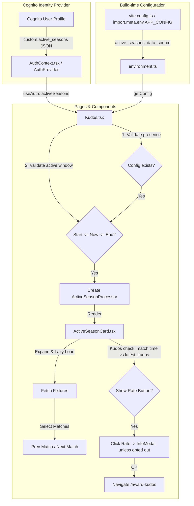

# In-season Domain Logic From Cognito Users & Configuration Files

This document explains how the **logged-in user's active seasons** (stored in Cognito user profiles) and the **configured active seasons** (stored in build-time configuration files) come together in the front-end codebase to drive the In-seasons fixtures and match results visualisations, as currently implemented in the Kudos page.

---

## 1. User's Active Seasons

The user's active seasons represent the leagues, seasons, and teams to which the logged-in user is registered with, in the app.

### Domain Model
The `ActiveSeason` represents a user registration for a specific league and season: 
- `league` (e.g., "CLTTL"), 
- `season` (e.g., "2025"), 
- `team_name` (e.g., "Table Tennis Aces"), 
- `team_division` (e.g., "Division 1"), 
- etc.

In practice, a user can only be registered to one team per division during a single season of a league. Throughout the season, a user may move up to a higher division or, in rare cases, move down. Occasionally, a user might play for another team within the same club and division, but this typically does not result in a formal registration for that second team.

Therefore, a user will generally have a maximum of one registration for the same league + season + team_division. However, it is common for a user to play for the same team and division across multiple seasons and therefore to have multiple registrations for the same league + team_division (but not season).

Note: While these real-world rules are generally valid, they are not strictly enforced in the codebase, and the system's logic does not rely on them.

### Data Source and Retrieval
1. **Cognito Custom Attribute**: The user's active seasons are stored in **Cognito** under the custom user attribute `custom:active_seasons` (or fallback `active_seasons`).
2. **Parsing**: 
   * When the user session is verified (on mount) or after standard sign-in, the provider validates and converts the raw JSON string value into an array of `ActiveSeason` objects.
3. **State Management**: The parsed array is stored globally in the `AuthProvider` component state and exposed as a `activeSeasons` page variable.

### Files Involved
The implementation files are located in the:
* [contexts folder](TTLeaguePlayersApp.FrontEnd/src/contexts/) 

### Additional Details For The Agent
* **Parsing Validation**: The parser `parseActiveSeasonsJson` checks that structural properties (`league`, `season`, `team_name`, `team_division`, `person_name`, `role`) are valid strings. It also filters `latest_kudos` to ensure it only contains numeric timestamps. If the raw attribute is missing, invalid JSON, or structurally invalid, it returns `[]`.
* **State Updates**: The application exposes `refreshActiveSeasons` through the context interface to allow re-fetching Cognito attributes on-demand (e.g., after updating registration status).

---

## 2. Active League Seasons Configuration Info

Configured seasons come from the config files included in the delivered app, that also define the processing logic, the metadata, and start-end date boundaries of the league's season.

### Domain Model
The global configuration contains a list of supported data sources under `active_seasons_data_source` for a specific league and season with a start and end date: 
- `league` (e.g., "CLTTL"), 
- `season` (e.g., "2025"), 
- `registrations_start_date` (epoch timestamp in seconds when user registration & match rating starts),
- `ratings_end_date` (epoch timestamp in seconds when the season match rating ends),
- etc.

In the configuration file, an active_seasons_data_source should contain only one entry per unique league and season combination, without duplicates. However, a league can span multiple seasons, resulting in multiple entries across different seasons. The start and end dates of different seasons should not overlap.

Note: While this constraint is not strictly enforced in the codebase, the Kudos page assumes it to be true and will only fetch the first entry found for any given league and season, ignoring any duplicates where it exists.

### Data Source and Retrieval
* The configuration is build-time environment-dependent (prod, staging, test, dev). The configuration file is injected directly into the bundle.
* The configuration is then loaded synchronously at runtime.

### Files Involved
The implementation files are located in:
* [config folder](TTLeaguePlayersApp.FrontEnd/src/config/)

### Additional Details For The Agent
* **Bundler Injection**: The bundler (Vite) replaces references to `import.meta.env.APP_CONFIG` with the actual JSON configuration file matching the active target environment.
* **Retrieval Hook**: The `getConfig()` function in [environment.ts](TTLeaguePlayersApp.FrontEnd/src/config/environment.ts) retrieves this config synchronously, throwing an error at startup if the configuration is undefined.
* **Assumption: the config and the league site's pages are always current for the current season.** Nothing reconciles them, and nothing detects drift — a division, club or team added on the league site is invisible to the app until the config is edited by hand and the relevant cache expires. The same assumption is recorded in [FrontendActivelyManagedClubsDomainLogic.md](prompts/codebase_info/FrontendActivelyManagedClubsDomainLogic.md).
* **Because the config is injected at BUILD time**, changing it requires a rebuild and redeploy of the frontend; it is not a runtime setting.

---

## 3. User's In-season Logic: User's Active Seasons + Active League Seasons Configuration Info

The In-season and Off-season logic resolves and merges the user’s seasons with the global league configurations to decide what seasons to display as ongoing. It is currently implemented only in the Kudos page.

### Business Logic
1. **Registration Check**: 
   * If the user has zero `activeSeasons`, a warning is displayed stating that the user is not registered to a league, season, and team. It displays steps to resolve this (e.g., using the invite link or asking to the captain).
2. **Matching Configuration Check**:
   * Every user's `ActiveSeason` is searched among the active league seasons in the configuration info matching the league and the season. If no matching config is found, the season is skipped, otherwise it is a match.
3. **Time Window Check (In-Season Period)**:
   * When the current system epoch time (seconds) falls outside the configuration's active start-end dates, the season is omitted, otherwise it is a match.
4. **Processor Instantiation**:
   * If both Matching Configuration and Time Window checks succeed, the active season is rendered with the related info (fixtures, etc.) and features made available by the page.

This graph represents such logic:

```
                  User's Active Seasons (Cognito)
                                |
                   Iterate each user season
                                |
             Does a matching config data source exist?
             /                                       \
          [No]                                       [Yes]
           /                                           \
    Throw/Log Error                             Check time window
                                            (Start <= Now <= End)
                                            /                  \
                                         [No]                  [Yes]
                                          /                      \
                                    Ignore season        Create ActiveSeasonProcessor
                                                         & Render ActiveSeasonCard
```

### Files Involved
The implementation file of this logic is currently located in:
* [Kudos Page](TTLeaguePlayersApp.FrontEnd/src/pages/Kudos.tsx) — resolves the logic inline, for every active season whatever its role
* [Invite Team Members Page](TTLeaguePlayersApp.FrontEnd/src/pages/InviteTeamMembers.tsx) — the captain-only page; it applies the same three checks through [activeSeasonUtils.ts](TTLeaguePlayersApp.FrontEnd/src/utils/activeSeasonUtils.ts) (`selectCaptainSeasons`), which adds a fourth: the active season's `role` must be `CAPTAIN`. The menu entry for it is gated on `isCaptain` (`hasCaptainRole`, in that same `activeSeasonUtils.ts`, where `isCaptainSeason` states the `role === 'CAPTAIN'` rule once for both), which is **narrower than `isPlayerOrCaptain`**: a plain player of a team satisfies that one.

### Additional Details For The Agent
* **System Time Fetching**: Current time is checked by retrieving epoch seconds using `getClockTimeInEpochSeconds()` from [DateUtils.ts](TTLeaguePlayersApp.FrontEnd/src/utils/DateUtils.ts).
* **Processor Factory Pattern**: The page constructs the processing logic dynamically via `createActiveSeasonProcessor(...)` in [ActiveSeasonProcessorFactory.ts](TTLeaguePlayersApp.FrontEnd/src/service/active-season-processors/ActiveSeasonProcessorFactory.ts). This maps the config strategy key (`custom_processor`) to the corresponding parsing engine class and injects scraping parameters.
* **The `ActiveSeasonProcessor` port** ([ActiveSeasonProcessor.ts](TTLeaguePlayersApp.FrontEnd/src/service/active-season-processors/ActiveSeasonProcessor.ts)) is bound to one division and one team and exposes two reads:
	* `getTeamFixtures()` — the team's fixtures, played and unplayed, sorted by start date (used by the Active Season Card). For CLTTL 2025 it is read from the division's fixtures page in its **Simple view** (`…/Fixtures?leagueName=…&divisionName=…&vm=2`, the parameter lives in the configured `division_fixtures` URL): one fetch for the whole division, then filtered by team name. That view is the only division-wide one small enough for the CORS proxy (768 KB cap), and it carries only date, time, the two teams and the venue — so `Fixture` is `{ startDateTime, venue, homeTeam, awayTeam }`, no players and no completion flag. The page prints no year: it is inferred from the page's own season (`Winter 2025-26` → Aug–Dec 2025, Jan–Jul 2026), and the time is kept as the page's wall-clock reading labelled UTC (`…T19:30:00Z`) because that instant is the key under which kudos are stored.
	* `getTeamPlayers()` — the names of the players **registered** to the team, spelled exactly as the league site spells them, as a `string[]`. For CLTTL 2025 it is read from the division's averages page (`…/Averages?leagueName=…&divisionName=…`, the configured `division_players` URL) filtered by the team id found in that page's `select#filterTeam` (two fetches: the division page for the id, then the same URL with `&t=<id>`). It lists **every player registered to the team, with or without matches**: the configured URL sets no `hzwp` parameter and the site's default is to show zero-played players (verified live 2026-09-21 — the Division Four page returns 91 players, 6 of them with none played, against 85 with `hzwp=true`). Reserves registered to another team are not on that page (verified on the live site). Consumed by the **Invite Team Members** page (`src/pages/InviteTeamMembers.tsx`), which selects the user's CAPTAIN active seasons with the same strict window as the Kudos page (`src/utils/activeSeasonUtils.ts`) and sends the roster to `POST /invites/registrations/team-players` to show each player's invitation status. A team whose season has not started yet has no averages table at all, and the call returns `[]`.
	* The factory wraps the processor in `ActiveSeasonProcessorWithLocalStorageCache` (SWR via `withSWR`: fixtures 72h fresh / 6d stale; the players roster 24h fresh / 3d stale, shorter because the captain's invitation-status view is keyed on it and a roster change must be noticed within a day). The factory supplies the identity prefix `cache_{league}_{season}_{division}_{team}`; the decorator appends one suffix per method — `_fixtures`, `_players` — so the two reads never share a localStorage entry (`withSWR` cannot tell a `Fixture[]` from a `string[]`). Nothing invalidates these keys; entries live until the browser evicts them.
* **Every fetch goes through the CORS proxy in the browser** (`avoidCORS = true` at all three call sites), and the fetcher URL-encodes the target page into the proxy's `url=` parameter: sent raw, the target's first `&` would end that parameter and silently drop `divisionName`, `vm` and `t`. The proxy also rejects responses over 768,000 bytes, which is why the page variants above were chosen.
* **`ActiveSeasonProcessor` is not the only port in that folder.** A parallel `ManagedClubProcessor`, with its own factory and config key (`custom_club_processor`), serves the club-manager flows — see [FrontendActivelyManagedClubsDomainLogic.md](prompts/codebase_info/FrontendActivelyManagedClubsDomainLogic.md). Club-side capabilities belong there: `getTeamFixtures()` and `getTeamPlayers()` are bound to a division and a team, which a club manager does not have. Do not widen `ActiveSeasonProcessor` to carry them.

---

## 4. Visualisation and Interactions on the Active Season Card

The active season card visualises the In-season matches as selected according to the previous logic, and handles individual season layout, loading fixtures, selecting previous and next matche, and presenting the Kudos rating actions in the Kudos page.

Since it is possible for a user to have multiple In-season League-Season-Team items active, the active season card allows the user to toggle between the multiple items, and then visualises the fixtures and Kudos rating actions related to the item the user visually selected.

### Files Involved
The component is implemented in:
* [ActiveSeasonCard.tsx](TTLeaguePlayersApp.FrontEnd/src/components/ui/ActiveSeasonCard.tsx), used by the [Kudos Page](TTLeaguePlayersApp.FrontEnd/src/pages/Kudos.tsx)

This is **not the only card driven by the logic of section 3**: the captain-only team players card is the other one, and section 5 below covers it. Everything in this section is specific to the matches-and-kudos card and does not transfer.

### Additional Details For The Agent
* **Lazy Load Execution**: The component uses a React `useEffect` to trigger data fetching (`processor.getTeamFixtures()`) only when the card is expanded (`isExpanded === true`).
* **Fixture Windowing**: 
  * Compares fixtures using a sliding window: `twoHoursAgo = now - 2 hours`.
  * The first fixture where `startDateTime >= twoHoursAgo` becomes `nextMatch`.
  * The fixture immediately prior to `nextMatch` (index `i-1`) is assigned to `prevMatch`.
  * If no upcoming fixtures match, `nextMatch` is set to `-1` ("None"), and the last scheduled match in the array is set as `prevMatch`.
* **Chronological Rating Constraint**: The helper `shouldShowRateButton` checks if a match can be rated:
  * The match timestamp must not exist in the active user's `latest_kudos` array (already rated).
  * The match timestamp must be strictly greater than the maximum timestamp in `latest_kudos` (enforcing ratings are submitted in chronological order), or the `latest_kudos` list must be empty.
* **Navigation Context Passing**: Clicking the Rate button routes the user to `/award-kudos` with navigation state properties containing: `league`, `season`, `teamDivision`, `teamName`, `personName`, `opponentTeam`, `matchDateTime`, `isHome`, and `venue`.
* **Info modal before navigation**: unless the user has already opted out, clicking Rate first shows a shared `InfoModal` (see `InfoModal.tsx` in the technical architecture doc) with information on dispute responsibilities and a "don't show this message again" checkbox; only after it is dismissed does the navigation above happen. The same component is also reused, under different GUIDs, for two independent messages shown in sequence on the Kudos Standings and My Club Standings pages after a successful load (see the "Actively Managed Clubs" domain logic doc for the My Club Standings side of this).

---

## 5. Visualisation and Interactions on the Captain's Team Players Card

The captain's team players card visualises **one team the user captains**, and handles the features a captain has over that team's membership: showing every player registered to the team on the league site together with their invitation status in this app, and sending an invite to the ones nobody has invited yet.

Since a user may captain several teams (different leagues, or different teams in one league), the page renders one card per captaincy and lets the user toggle between them, then visualises the roster of the team visually selected.

**The selection is the logic of section 3, unchanged, plus one rule.** Do not restate or re-derive it here: the same `custom:active_seasons` claim, the same `active_seasons_data_source` config matched on league **and** season, the same **strict** time window, and the same `createActiveSeasonProcessor(...)` port. The one addition is a **fourth check — the active season's `role` must be `CAPTAIN`** — and it is stated once, as `isCaptainSeason`, which both `selectCaptainSeasons` and `hasCaptainRole` are built on.

What is genuinely distinct from section 4 is everything after the selection: the reads, the states, and the action.

1. **Two sequential reads, per card, on expansion.** First the roster — `getTeamPlayers()`, the section 3 bullet — which is the names as the **league site** spells them. Then their status in this app: `POST /invites/registrations/team-players`, through `getCachedTeamPlayersRegistrations`, sending exactly those names.
2. **The status of a name** is `ACCEPTED` (registered), `PENDING` (invited, not yet accepted) or `NOT_INVITED`, rendered as *Registered* / *Invite sent* / an **Invite** control, with the accepted or sent date and the invitee's e-mail on a second line. The labels, pill colours and status ordering are shared with the club-manager teams list so a status reads identically across the app.
3. **Extras.** The response is a full outer join, so it also returns the team's invites that match no roster name — spelling drift, someone who left, someone the league has not registered yet. They carry no `player_name`, are never `NOT_INVITED`, and are listed after the roster under their own label, with no action.
4. **Sending an invite** creates a PLAYER invite through `inviteApi.createInvite` under the **roster** spelling (that spelling is the join key on the next read, and becomes the invitee's `person_name` when they accept), with the captain's own `person_name` as `invited_by`. The e-mail address is collected in a dialog, because no league page carries it.

### Files Involved
* [InviteTeamMembers.tsx](TTLeaguePlayersApp.FrontEnd/src/pages/InviteTeamMembers.tsx) — the page: selection, one processor per captaincy, which card is open, and two empty states
* [TeamPlayersCard.tsx](TTLeaguePlayersApp.FrontEnd/src/components/ui/TeamPlayersCard.tsx) — one captaincy as a collapsible card, wearing the same header as `ActiveSeasonCard`
* [TeamPlayersList.tsx](TTLeaguePlayersApp.FrontEnd/src/components/ui/TeamPlayersList.tsx) — the two reads, the render states, the rows and the invite action (the club-manager counterpart is `ClubTeamsList.tsx`)
* [InvitePlayerDialog.tsx](TTLeaguePlayersApp.FrontEnd/src/components/ui/InvitePlayerDialog.tsx) — collects and validates the invitee's e-mail
* [activeSeasonUtils.ts](TTLeaguePlayersApp.FrontEnd/src/utils/activeSeasonUtils.ts) — `isCaptainSeason`, `hasCaptainRole`, `selectCaptainSeasons`

### Additional Details For The Agent
* **Lazy load is a GUARANTEE, not one mechanism.** No card may read anything while collapsed — otherwise a captain of three teams scrapes three rosters on every visit. Section 4's card honours it with a `useEffect` guarded on `isExpanded`; this card honours it by **not mounting `TeamPlayersList` at all** while collapsed, the list fetching on mount. Either is correct; do not "align" one to the other on the assumption that the effect is the rule.
* **`isCaptain` is narrower than `isPlayerOrCaptain`.** The latter only says the user has *some* active season, so a plain player of a team satisfies it. The menu entry and this page are gated on `isCaptain`. This is the app's only flag that inspects a claim's `role`; the others count entries.
* **`isCaptain` does not consider the window.** A captain whose seasons are all closed still sees the menu entry, and the page then explains that none is active — which is why the page has **two** distinct empty states: one about the ROLE (permanent until someone invites them as a captain) and one about the CLOCK (fixes itself next season).
* **`avoidCORS` must be `true`** in the factory call, as on every other call site. It is the last parameter and defaults to `false`; getting it wrong sends the scrape into a CORS failure and leaves the card body empty.
* **Four render states, deliberately distinct**, because they have different causes and different wording: loading; the **roster** could not be read at all (the league has no configured players page — true of every league whose config carries no `division_players` entry — or the team is not on the division page, or the site is unreachable); the **statuses** could not be read (a live API call on every expansion, so the likelier of the two); and the roster is empty (a season not yet started on the site). An expanded card with a blank body is the one failure a captain cannot interpret, so neither failure is silent.
* **Never call the status endpoint with an empty name list** — it is a 400, and the client has no guard of its own.
* **Branch a row's date on `status`, never on which date field is present.** `accepted_at` is always present and is `null` on **both** `PENDING` and `NOT_INVITED`, so its null cannot tell those two apart.
* **`nano_id` is a capability token.** It is present on every invited entry and on the created invite, and it must never reach the DOM — not as text, not as a React key, not as a test id.
* **The caches are separate and are invalidated differently.** The roster shares section 3's `cache_{league}_{season}_{division}_{team}_players` (24 h / 3 d, nothing invalidates it). The statuses live under `invite_cache_players_{league}_{season}_{team_division}_{team_name}` (1 d / 3 d), and `createInvite` clears the whole `invite_cache_` prefix, which is what makes the read after a send go to the API.
* **After a send, the row is updated from the API's own response, and only then are the statuses re-read.** A failed *create* propagates to the dialog, which stays open with the reason and nothing written; a failed *re-read* is only logged, because the row is already correct. Without the local update a failed re-read would leave the row saying "Not invited" about someone who has been invited, and a second press would create a duplicate invite and a second e-mail — the backend has no duplicate guard, and the API client retries POSTs. Nothing refreshes automatically afterwards.
* **No Invite control on the logged-in captain's own row.** Accepting a self-invite appends a **second** `custom:active_seasons` entry for the same team, and nothing in the app can remove a claim entry; the Kudos page would then list that team twice. The row is recognised by comparing the roster name with the captain's `person_name`, trimmed and case-insensitively, the same rule the backend applies to names — so drift beyond case or space leaves the control in place.
* **There is no captain-side check on the backend, by decision.** `POST /invites` is `Authorizer: NONE` and extracts no claims, so a check there would run on an unverified token; authenticating the route would break the token-less acceptance fixtures and the by-hand creation flow. The gating here is client-side only, and is a navigation aid rather than a security control.
* **The strict window has a per-environment consequence.** Environment configs close the current season on different dates, so this page can read empty in one environment while still listing teams in another, until the next season is configured.

---

## Kudos Page: Example Of The Data Flow Of This Logic

The diagram below outlines how the user context, build-time configurations, pages, and components interact to render active seasons and matches:


```mermaid
graph TD
    subgraph Cognito Identity Provider
        C[Cognito User Profile] -->|custom:active_seasons JSON| ACP[AuthContext.tsx / AuthProvider]
    end

    subgraph Build-time Configuration
        BC[vite.config.ts / import.meta.env.APP_CONFIG] -->|active_seasons_data_source| ENV[environment.ts]
    end

    subgraph Pages & Components
        ACP -->|useAuth: activeSeasons| K[Kudos.tsx]
        ENV -->|getConfig| K
        
        K -->|1. Validate presence| V1{Config exists?}
        K -->|2. Validate active window| V2{Start <= Now <= End?}
        
        V1 -->|Yes| V2
        V2 -->|Yes| P[Create ActiveSeasonProcessor]
        
        P -->|Render| ASC[ActiveSeasonCard.tsx]
        ASC -->|Expand & Lazy Load| F[Fetch Fixtures]
        F -->|Select Matches| PM[Prev Match / Next Match]
        ASC -->|Kudos check: match time vs latest_kudos| RB{Show Rate Button?}
        RB -->|Yes| IM[Click Rate -> InfoModal, unless opted out]
        IM -->|OK| RM[Navigate /award-kudos]
    end
```
